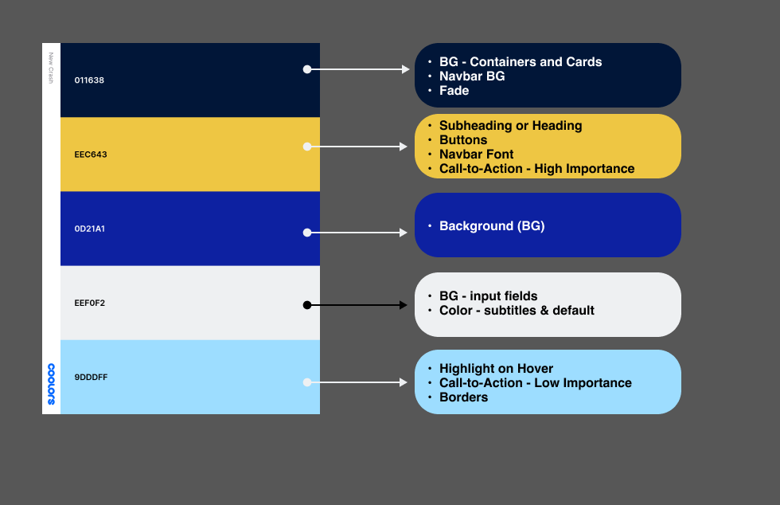

# **_Emmanuel Rosario_** - Personal Portfolio Website

A Simple yet effective website to showcase what I have to offer. It was all done by me.
I wanted to showcase my skills as a front-end developer. This website showcases that with great design in both UI and UX decisions.
I made the website as easy to navigate, with a sticky Navbar.

_Front-end project_

**Technologies**

**_Javascript, React, Tailwind, CSS, HTML, Vite, Figma_**

# Project Goals

_Goals set forth for the project._
_What I want for the Minimum Viable Product and Post Minimum Viable Product_

### 🔴 MVP

- **Landing Page**
  - The first page a visitor sees.
  - Includes my first name, last name and title.
  - It contains an introduction of myself and encourages the visitor to explore the website.
- **Navbar and Footer**
  - Always present for ease of access.
  - Navbar holds the navigation of the site. Allowing the user to go different pages no matter where they are in the website.
  - Footer holds my socials, website code, created by stamp, and a quick synopsis of the website.
- **Projects Page**
  - Projects page showcases all my software engineer projects.
  - Each project card is clickable and takes you to their details page.
- **About Me Page**
  - More descriptive and personal take on my. Learning about me as an individual.
  - Showcasing my languages, design tools and frameworks that I know.
  - Displays my resume for quick view.
- **Contacts Page**
  - Contains a minimum two contacts - Email and Phone number.
  - Have social media and alternative media links.
- **Project Details Pages**
  - Showcase the projects.
    - Name of the Project.
    - Description of what the project is about.
    - Images to view what the project looks like.
    - Technologies used in the project.
    - Access to the code, that the project used.

### 🟢 POST-MVP

- **Landing Page**
  - A way to display my coding activity via Github or Leetcode.
- **Navbar and Footer**
  - Ability to toggle between original color scheme and dark mode.
  - Burger menu when in mobile view
- **Projects Page**
  - Dynamically map all the projects
- **About Me Page**
  - More descriptive and personal take on my. Learning about me as an individual.
  - Showcasing my languages, design tools and frameworks that I know.
  - Displays my resume for quick view.
- **Contacts Page**
  - An active email form to contact me directly.
- **General Website**
  - An active blog / updates section.

## ♾ Ongoing 🔄

    - Optimizations of code
    - Insertion of new features. Including post-mvp and unannounced ones.

## ✨ Inspiration 🌟

 

  <b> Design</b> 

My inspiration for my website was to be reminscent of the older desktop's crash screens. Primarily with the color scheme, fonts and overall feel that was provided. Below are some examples that I took inspiration from.

### vv Windows 11 Crash vv

### vv Windows 9x Crash vv

 

These screens were created to be simple yet invoke a sense of urgancy to the user. Displaying text that just described to the issue with the computer.

_Within the website, I didn't want to give that sense of urgency at that level of intensity. Rather, give the feeling of professional yet simple. So I implemented more colors and used shape to help display that. Curving edges, softer type and using warm and inviting colors._

  
 <b>Color Schemes</b> 

   

### Default Color Scheme

 

### Default Color Scheme Guidelines

 

### Dark Color Scheme

### Dark Color Scheme Guidelines

 

### Alternate Themes / Draft Themes

## Layouts

Below are mock-ups created within Figma. They show my thought process and planning phase before embarking on this project.

**_I started with a mobile design first before going to the desktop design. I did this because I knew I wanted to use Tailwind within this project._**

**_They are general layouts that were planned for the website. Some alterations were made due to personal preferences._**

### Mobile📱

#### Navbar

<b>Dark Mode</b>

#### Home

<b>Dark Mode</b>

#### About Me

<b>Dark Mode</b>

#### Contacts

<b>Dark Mode</b>

#### Projects

<b>Dark Mode</b>

#### Individual Projects

<b>Dark Mode</b>

## Desktop 💻

#### Home / Nav / Footer

<b>Dark Mode</b>

#### About Page

<b>Dark Mode</b>

#### Contacts Page

<b>Dark Mode</b>

#### Projects

<b>Dark Mode</b>

#### Individual Projects

<b>Dark Mode</b>

## Attributions

#### Images:

- [All Tech & Software Logos](icons8.com)
- [Instagram ⟹ Official logo](https://about.meta.com/brand/resources/instagram/instagram-brand/)
- [LinkedIn ⟹ Official logo](brand.linkedin.com)
- [Github ⟹ Official logo](https://github.com/logos)
- [Favicon](https://favicon.io/)

#### Services & Resources:

- [Emailjs ⟹ Emailing service](https://www.emailjs.com/)
- [Github Pages ⟹ Website hosting](https://pages.github.com/)
